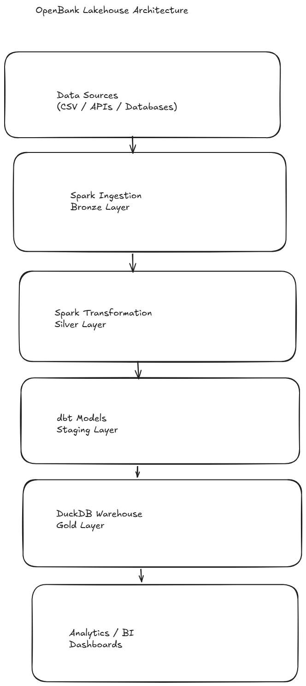

# OpenBank Lakehouse

End-to-end lakehouse data engineering project demonstrating a modern analytics architecture using Apache Spark, dbt, DuckDB, and Docker.

---

# Architecture

Bronze → Silver → Data Vault → Gold



Detailed architecture documentation:

docs/architecture.md

---

# Tech Stack

| Layer | Tool |
|------|------|
| Processing | Apache Spark |
| Storage | Parquet |
| Modeling | dbt |
| Warehouse | DuckDB |
| Containerization | Docker |

---

# Pipeline Flow

1. Ingest raw banking data into Bronze layer using Spark
2. Clean and transform data into Silver layer
3. Build staging models using dbt
4. Load analytics-ready tables into DuckDB warehouse

---

# Run The Project

Start the environment

```bash
docker compose up -d