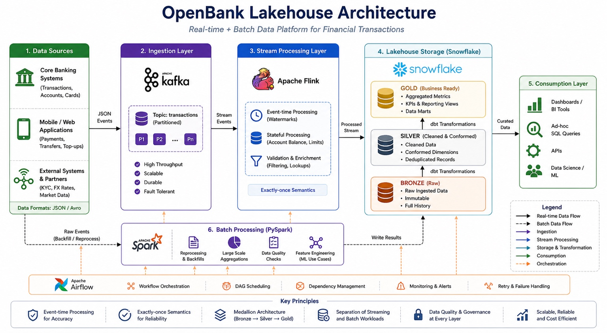

# OpenBank Lakehouse

Real-time + Batch Data Platform for Financial Transactions

---

# Architecture Overview



---

# Project Overview

OpenBank Lakehouse is a modern real-time data engineering project designed to simulate a production-style financial data platform.

The project focuses on:

- Real-time event ingestion
- Stream processing
- Event-time analytics
- Window aggregations
- Medallion lakehouse architecture
- Batch + streaming integration

---

# Current Architecture

```text
Python Producer
        ↓
Kafka Topic (transactions)
        ↓
Apache Flink SQL
        ↓
Window Aggregation
        ↓
Kafka Topic (transactions_agg)
```

---

# Target Architecture

```text
Data Sources
    ↓
Apache Kafka
    ↓
Apache Flink
    ↓
Snowflake Bronze Layer
    ↓
Snowflake Silver Layer
    ↓
Snowflake Gold Layer
    ↓
BI / Analytics / APIs
```

---

# Tech Stack

| Layer | Technology |
|---|---|
| Streaming | Apache Kafka |
| Stream Processing | Apache Flink |
| Batch Processing | Apache Spark |
| Storage | Snowflake |
| Transformations | dbt |
| Orchestration | Apache Airflow |
| Programming | Python |
| Containerization | Docker |

---

# Features Implemented

## Kafka Streaming
- Real-time transaction producer
- Kafka topic creation
- JSON event streaming
- Partitioned event ingestion

## Flink Streaming
- Kafka source integration
- Event-time processing
- Watermark implementation
- Tumbling window aggregation
- Upsert Kafka sink

## Streaming Aggregation
- Account-wise aggregations
- Window-based metrics
- Transaction counts
- Total transaction amount

---

# Key Engineering Concepts

- Event-time Processing
- Watermarking
- Stateful Stream Processing
- Tumbling Windows
- Upsert Kafka
- Append vs Update Streams
- Exactly-once Semantics
- Medallion Architecture

---

# Engineering Challenges Solved

- Kafka Docker networking issues
- Kafka listener configuration
- Flink Kafka connector integration
- Event timestamp conversion
- Watermark configuration
- Upsert Kafka topic setup
- Streaming aggregation debugging
- Flink resource allocation issues

---

# Project Structure

```text
openbank-lakehouse/
│
├── docs/
│   └── architecture.png
│
├── kafka/
│   ├── docker-compose.yml
│   └── producer.py
│
├── flink/
│   ├── docker-compose.yml
│   ├── lib/
│   └── sql/
│       ├── transactions_source.sql
│       ├── transactions_agg_sink.sql
│       └── window_aggregation.sql
│
├── screenshots/
│   ├── producer-running.png
│   ├── flink-stream-processing.png
│   └── kafka-topic-output.png
│
├── requirements.txt
│
└── README.md
```

---

# Sample Event Schema

```json
{
  "txn_id": "1001",
  "account_id": "A100",
  "amount": 250.50,
  "ts": 1778146701.17
}
```

---

# SQL Scripts

| File | Purpose |
|---|---|
| transactions_source.sql | Kafka source table |
| transactions_agg_sink.sql | Kafka upsert sink |
| window_aggregation.sql | Tumbling window aggregation |

---

# Setup Instructions

## Start Kafka

```bash
docker-compose -f kafka/docker-compose.yml up -d
```

## Start Flink

```bash
docker-compose -f flink/docker-compose.yml up -d
```

## Run Producer

```bash
python kafka/producer.py
```

## Open Flink SQL Client

```bash
docker exec -it jobmanager ./bin/sql-client.sh
```

---

# Current Implementation Status

## Completed

- Kafka setup using Docker
- Real-time transaction producer
- Kafka topic configuration
- Flink SQL integration
- Event-time processing
- Watermark implementation
- Tumbling window aggregation
- Kafka upsert sink integration
- Real-time aggregation pipeline

---

# Planned Implementation

## Snowflake Layer
- Bronze Layer
- Silver Layer
- Gold Layer

## Batch Processing
- Spark reprocessing
- Large-scale aggregations
- Data quality validation

## Transformation Layer
- dbt models
- Curated business metrics

## Orchestration
- Airflow DAG scheduling
- Monitoring and alerting

---

# Screenshots

## Kafka Producer


## Flink Streaming


## Kafka Aggregation Output


---

# Future Scope

- Oracle CDC integration
- Snowpipe Streaming
- Schema Registry
- Kafka Connect
- Infrastructure as Code
- CI/CD pipeline
- Monitoring dashboards
- Production deployment

---
